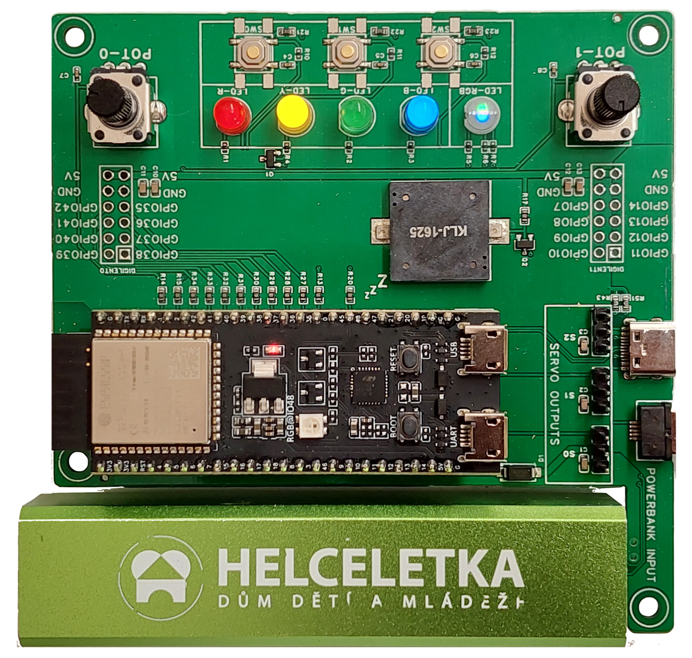

# RB3206-ELKS

ELKS neboli **ESP Learning Kit Starter** je vývojová deska pro mikrokontrolér ESP32-S3.
Jedná se o vzdělávací nástroj pro výuku elektroniky a základů programování.
Kity používáme v kroužcích pro začátečníky i pokročilé.

Desku lze napájet pomocí USB kabelu nebo power banky připojené přímo k desce.

## Funkce:
- LED
- Tlačítka
- Potenciometry
- Bzučák
- Servo výstupy
- Digilent PMOD konektory

    
    

    

