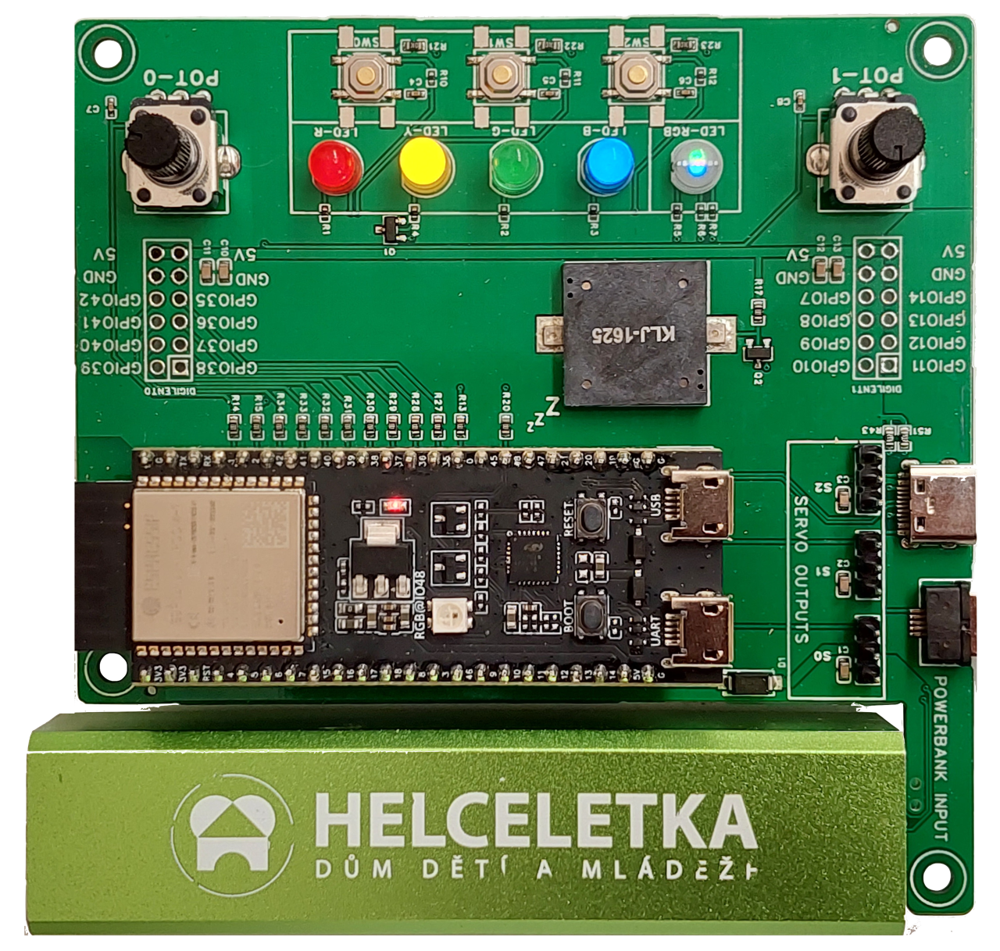
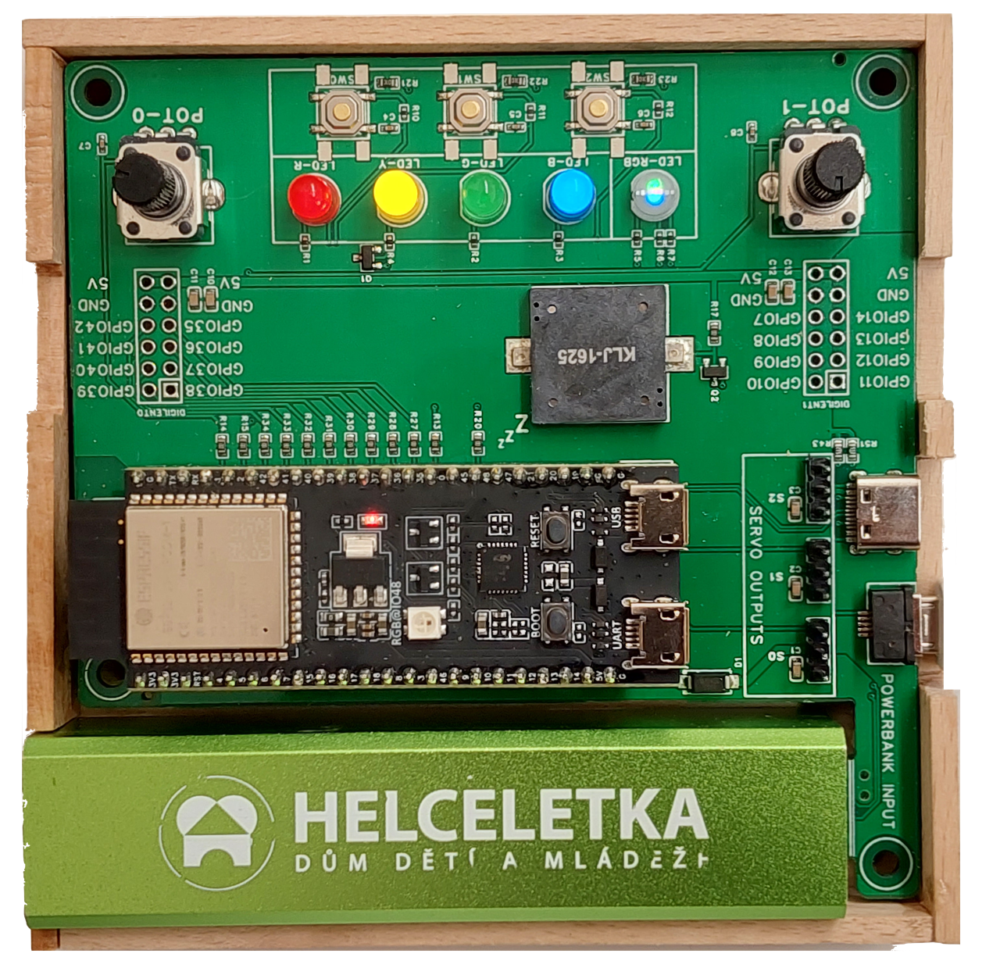
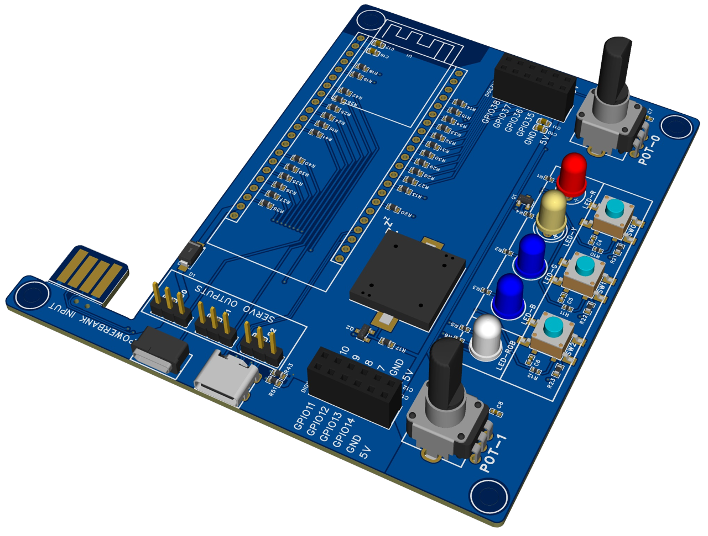
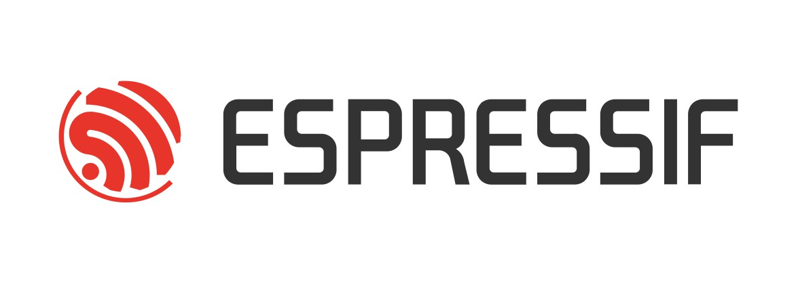

# RB3206-ELKS

ELKS aka **ESP Learning Kit Starter** is a development board for the ESP32-S3 microcontroller.
It's an educational tool for teaching electronics and embedded programming.
We employ it ourselves in courses for beginners and advanced students.

It can be powered by a USB cable or power bank coupled directly with the board.
This way you can take your ELKS with you anywhere and use it for your on-the-go projects.

## Features:
- Conventional LEDs
- Buttons
- Potentiometers
- Buzzer
- Servo outputs
- Digilent PMOD connectors

    
    

    

## [With the support of Espressif Systems](https://www.espressif.com/)

